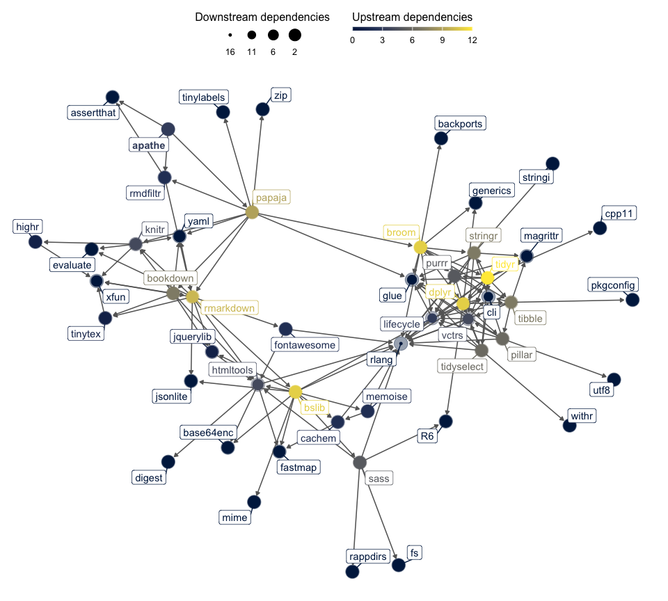

apathe: American Psychological Association Thesis<br />with R Markdown
================

<!-- README.md is generated from README.Rmd. Please edit that file -->

[](https://cran.r-project.org/package=apathe)
[](https://www.repostatus.org/#wip)

[](https://github.com/crsh/apathe/actions/workflows/R-CMD-check.yaml)
[](https://app.codecov.io/gh/crsh/apathe)
[](https://github.com/crsh/apathe/issues?q=is%3Aopen+is%3Aissue+label%3Abug)

**apathe** is an R package that facilitates writing computationally
reproducible student theses that conform to the American Psychological
Association (APA) manuscript guidelines (6th Edition). The package
provides an [R Markdown](https://rmarkdown.rstudio.com/) template that
can be used with (or without) [RStudio](https://posit.co/) to create PDF
documents (using the [apa6](https://www.ctan.org/pkg/apa6) LaTeX class).
**apathe** is built on top of the package
[**papaja**](https://github.com/crsh/papaja) but is tailored to the
specific requirements of student theses and omits some features for
simplicity.

If you believe you have found a bug or would like to request a new
feature, [open an issue](https://github.com/crsh/apathe/issues) on
Github and provide a [minimal complete verifiable
example](https://stackoverflow.com/help/minimal-reproducible-example).

## Installation

To use **apathe** you need either a recent version of
[RStudio](https://posit.co/) or [pandoc](https://pandoc.org/). You
additionally need a [TeX](https://en.wikipedia.org/wiki/TeX)
distribution; we recommend you use
[TinyTex](https://yihui.org/tinytex/), which can be installed from
within R:

``` r
if(!requireNamespace("tinytex", quietly = TRUE)) install.packages("tinytex")

tinytex::install_tinytex()
```

Using other TeX distributions is possible. Please refer to the
[**papaja**
manual](https://frederikaust.com/papaja_man/introduction.html#getting-started)
for detailed installation instructions.

**apathe** is not yet available on CRAN but you can install it from this
GitHub repository:

``` r
# Install remotes package if necessary
if(!requireNamespace("remotes", quietly = TRUE)) install.packages("remotes")

# Install the stable development version from GitHub
remotes::install_github("crsh/apathe")
```

## Usage

Once **apathe** is installed, you can select the APA-style thesis
template when creating a new R Markdown file through the RStudio menus.

To add citations, specify your bibliography-file in the YAML front
matter of the document (`bibliography: my.bib`) and start citing (for
details, see pandoc manual on the [citeproc
extension](https://pandoc.org/MANUAL.html#extension-citations)).
**apathe** supports DOI-based citations via the
[`doi2cite`](https://github.com/korintje/pandoc-doi2cite/blob/main/doi2cite.lua)
filter, see [**rmdfiltr**
vignette](https://CRAN.R-project.org/package=rmdfiltr/vignettes/doi2cite.html).
Any of the follow DOI tags can be used in the text:

- `@https://doi.org/`
- `@doi.org/`
- `@DOI:`
- `@doi:`

For example, `@doi:10.1080/01621459.2025.2516210`. When the document is
rendered, `doi2cite` queries CrossRef for the bibliographic information,
writes it to a local BibTeX-file and replaces the citation key by the
proper BibTeX key.

This requires that the designated file `__from_DOI.bib` (it currently
has to be this file name!) is added to the `bibliography` field of the
YAML front matter

## Citation

Please cite **apathe** if you use it.

    Aust, F. (2024). apathe: American Psychological Association Thesis with R Markdown. R package version 0.0.1. Retrieved from https://github.com/crsh/apathe

For convenience, you can [use
`cite_r()`](https://frederikaust.com/papaja_man/writing.html#citing-r-and-its-packages)
or copy the reference information returned by `citation('apathe')` to
your BibTeX file:

``` bibtex

@Manual{,
  title = {{apathe}: {American} Psychological Association Thesis with {R Markdown}},
  author = {Frederik Aust},
  year = {2024},
  note = {R package version 0.0.1},
  url = {https://github.com/crsh/apathe},
}
```

## Contribute

[](https://github.com/crsh/apathe/issues?q=is%3Aopen+is%3Aissue+label%3A%22help+wanted%22)
[](https://github.com/crsh/apathe/issues?q=is%3Aopen+is%3Aissue+label%3Adocumentation)

Like **apathe** and want to contribute? We highly appreciate any
contributions to the R package or its documentation. Take a look at the
[open issues](https://github.com/crsh/apathe/issues) if you need
inspiration.

### Code of Conduct

Please note that the **apathe** project is released with a [Contributor
Code of
Conduct](https://contributor-covenant.org/version/2/1/CODE_OF_CONDUCT.html).
By contributing to this project, you agree to abide by its terms.

## Package dependencies

<!-- -->
